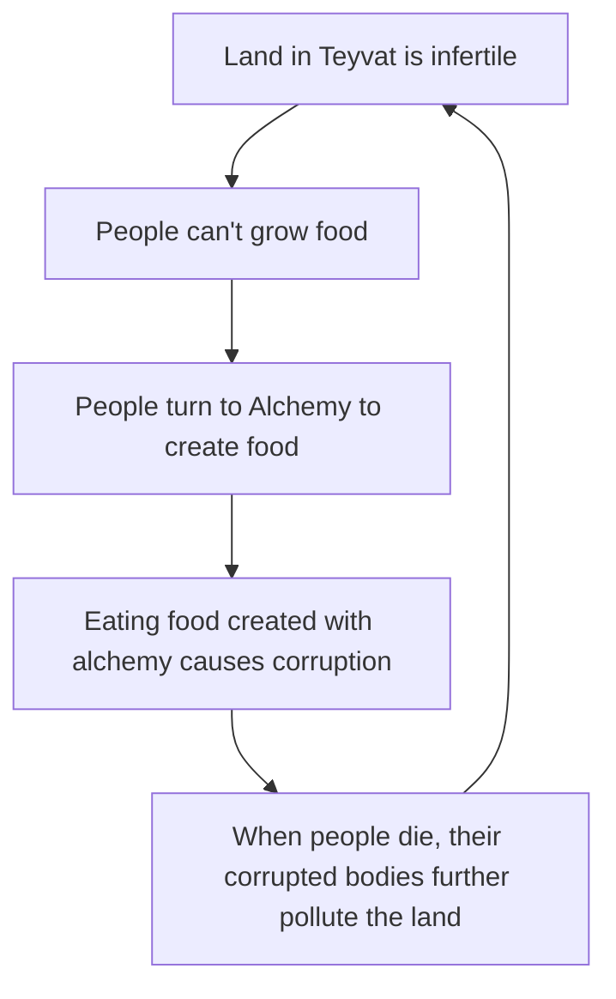

I still need to gather up all the evidence here, so for now you get a mostly blank page where I will just say that *so much* of this story is about fertilizer. In my head, it kinda works like this:

